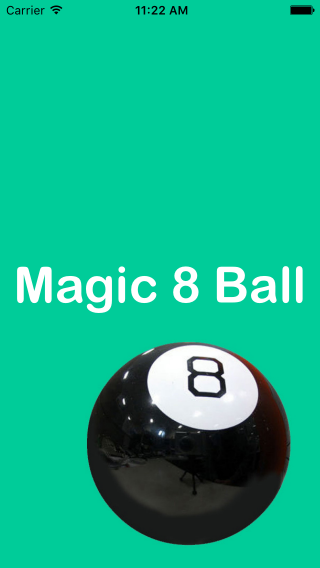
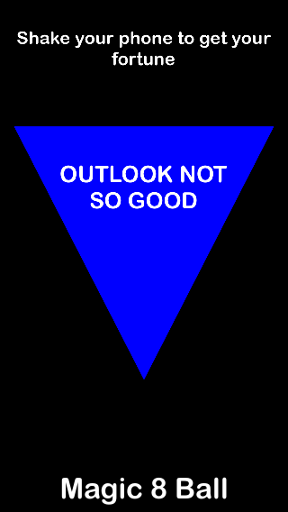
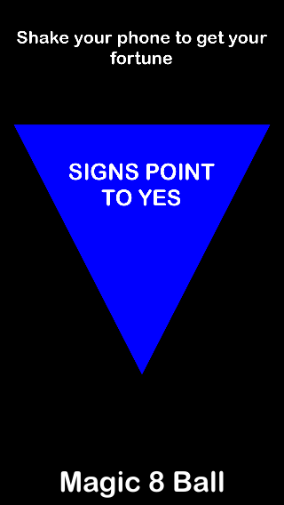

# Magic-8-Ball

An app version of the very popular fortune-telling device, the Magic 8 Ball. Similar to the original, simply shake your phone and your fortune will be revealed. 

## Requirements

- iOS 8.0+ / Mac OS X 10.9+
- Xcode 7.3+

## License

Magic 8 Ball is released under the MIT license. See LICENSE for details.